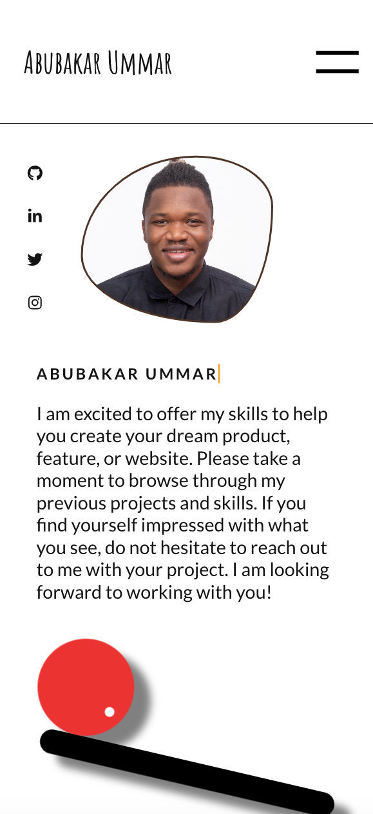
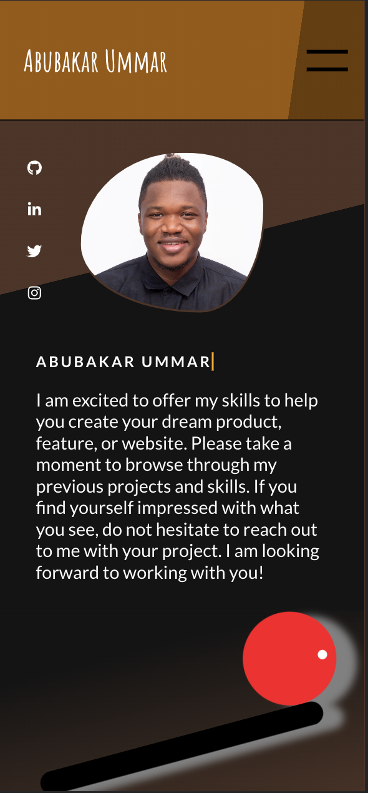
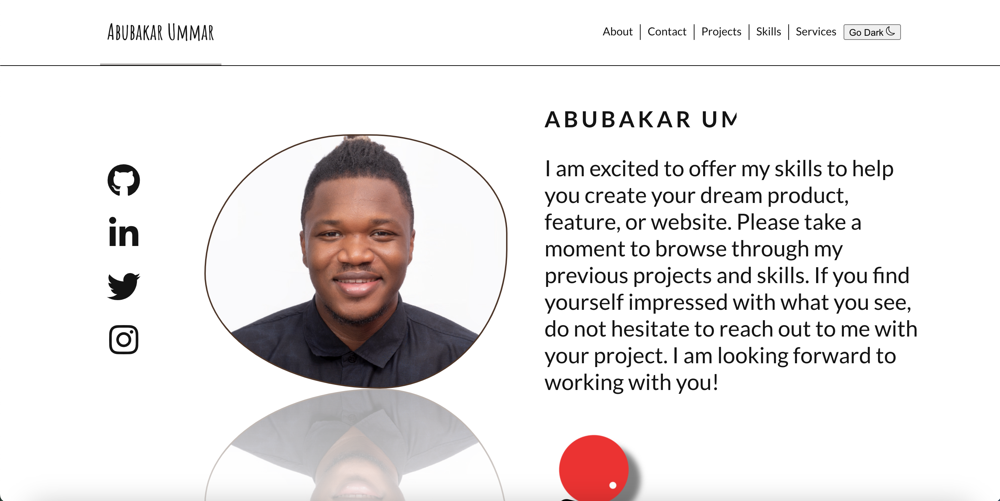
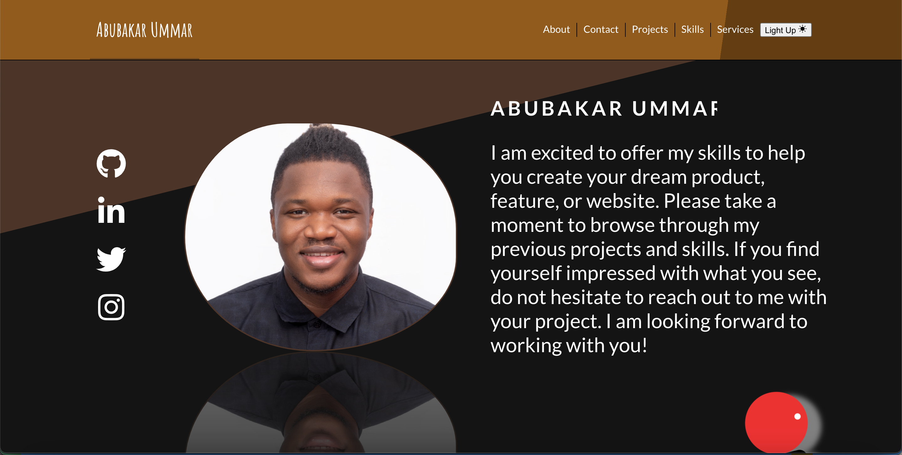

# My Portfolio

This a project that displays my projects and brief about Abubakar Ummar as a software developer.

## Table of contents

- [My Portfolio](#my-portfolio)
  - [Table of contents](#table-of-contents)
  - [Overview](#overview)
    - [The challenge](#the-challenge)
    - [Screenshot](#screenshot)
    - [Links](#links)
  - [My process](#my-process)
    - [Built with](#built-with)
    - [To run tests](#to-run-tests)
    - [run linters](#run-linters)
  - [Author](#author)
  - [Acknowledgments](#acknowledgments)

## Overview

### The challenge

Users should be able to:

- see a list of projects the developer has worked on.
- reach the developer via whatsapp when they click on the email, linkedin, and whatsapp button in the Contact Page.
- download the developers CV when they click on the "Download CV" button in the About page.
- see a list of skills the developer has when they click on the Skills page.

### Screenshot

### Links

- Solution URL: [Github](https://github.com/Haywayaheadshot/abu-the-portfolio)
- Live Site URL: [Live Demo](https://abubakar-ummar-portfolio.netlify.app/)

## My process

### Built with

- Semantic HTML5 markup
- CSS
- Flexbox
- CSS Grid
- Mobile-first workflow
- React
- Redux
- Javascript
- Github
- Vscode

>### Setup

- Clone this [repository](https://github.com/Haywayaheadshot/abu-the-portfolio.git) to your desired folder.
- Access `cd abu-the-portfolio`
- npm install
- npm start

### To run tests

- run `npm test`

### run linters
<!-- For eslint errors -->
- run `npx eslint .`
  
<!-- To correct eslint errors -->
- run `npx eslint . --fix`
  
<!-- For styelint -->
- run `npx stylelint "**/*.{css,scss}"`
  
<!-- To correct stylelint errors -->
- run `npx stylelint "**/*.{css,scss}" --fix`

## Author

- Github - [Abubakar Ummar](https://github.com/Haywayaheadshot)
- Linkedin - [Abubakar Ummar](https://www.linkedin.com/in/abubakar-ummar/)
- Twitter - [@haywayalive](https://twitter.com/haywayalive)

## Acknowledgments

- Thanks to Microverse for knowledge impacted.